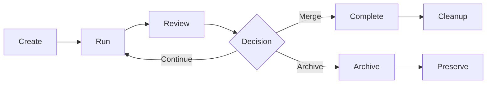

## What is a task?

A task in Emdash represents a discrete unit of work for an AI agent. Each task:

- Has its own git worktree (isolated working directory)
- Maps to a git branch for version control
- Contains one or more conversations with agents
- Tracks file changes, commits, and status
- Can be reviewed, merged, or archived independently

## Task lifecycle

Tasks move through a clear lifecycle from creation to completion:



### 1. Create

When you create a task:

1. Emdash checks for a worktree pool reserve
2. If available, instantly claims and renames the reserve
3. Otherwise, creates a new worktree (3-7 seconds)
4. Creates a main conversation with your chosen provider
5. Preserves configuration files (`.env`, etc.) to the worktree
6. Pushes the new branch to remote (if configured)

From `useTaskManagement.ts:54-66`:

```typescript
const runSetupForTask = async (task: Task, projectPath: string): Promise<void> => {
  const targets = getLifecycleTargets(task);
  await Promise.allSettled(
    targets.map((target) =>
      window.electronAPI.lifecycleSetup({
        taskId: target.taskId,
        taskPath: target.taskPath,
        projectPath,
        taskName: target.label,
      })
    )
  );
};
```

### 2. Run

During execution:

- Agent runs in the task's worktree
- All file changes are isolated to this worktree
- Multiple agents can run in parallel in different task worktrees
- You can switch between tasks without stopping agents

### 3. Review

When ready to review:

- View all file changes via the diff viewer
- See commit history on the task branch
- Review conversation history
- Test changes in the isolated worktree

### 4. Complete or archive

**Merge**: 
- Create a pull request from the task branch
- Merge via GitHub/GitLab
- Delete the task (removes worktree and branch)

**Archive**:
- Preserves the task record and metadata
- Keeps the worktree and branch
- Hides from active task list
- Can be restored later

**Delete**:
- Removes the worktree from disk
- Deletes local and remote branches
- Cleans up all PTY sessions
- Removes task from database

## Task database schema

From `schema.ts:58-83`:

```typescript
export const tasks = sqliteTable(
  'tasks',
  {
    id: text('id').primaryKey(),
    projectId: text('project_id')
      .notNull()
      .references(() => projects.id, { onDelete: 'cascade' }),
    name: text('name').notNull(),
    branch: text('branch').notNull(),
    path: text('path').notNull(),
    status: text('status').notNull().default('idle'),
    agentId: text('agent_id'),
    metadata: text('metadata'),
    useWorktree: integer('use_worktree').notNull().default(1),
    archivedAt: text('archived_at'), // null = active, timestamp = archived
    createdAt: text('created_at')
      .notNull()
      .default(sql`CURRENT_TIMESTAMP`),
    updatedAt: text('updated_at')
      .notNull()
      .default(sql`CURRENT_TIMESTAMP`),
  },
  (table) => ({
    projectIdIdx: index('idx_tasks_project_id').on(table.projectId),
  })
);
```

## Conversations

Each task can have multiple conversations, enabling:

- Multi-agent collaboration on the same task
- Different providers for different aspects
- Conversation-specific context and history

### Conversation schema

From `schema.ts:85-109`:

```typescript
export const conversations = sqliteTable(
  'conversations',
  {
    id: text('id').primaryKey(),
    taskId: text('task_id')
      .notNull()
      .references(() => tasks.id, { onDelete: 'cascade' }),
    title: text('title').notNull(),
    provider: text('provider'), // AI provider for this chat (claude, codex, qwen, etc.)
    isActive: integer('is_active').notNull().default(0), // 1 if this is the active chat for the task
    isMain: integer('is_main').notNull().default(0), // 1 if this is the main/primary chat (gets full persistence)
    displayOrder: integer('display_order').notNull().default(0), // Order in the tab bar
    metadata: text('metadata'), // JSON for additional chat-specific data
    createdAt: text('created_at')
      .notNull()
      .default(sql`CURRENT_TIMESTAMP`),
    updatedAt: text('updated_at')
      .notNull()
      .default(sql`CURRENT_TIMESTAMP`),
  },
  (table) => ({
    taskIdIdx: index('idx_conversations_task_id').on(table.taskId),
    activeIdx: index('idx_conversations_active').on(table.taskId, table.isActive),
  })
);
```

### Main vs. additional conversations

- **Main conversation** (`isMain: 1`): Primary conversation, typically created with the task
- **Additional conversations** (`isMain: 0`): Extra tabs for multi-agent work or different approaches

### Session isolation

For providers like Claude that support session IDs, each conversation gets its own session UUID to prevent state collision:

```typescript
// Main conversation PTY ID
const mainPtyId = `claude-main-${taskId}`;

// Additional conversation PTY ID  
const chatPtyId = `claude-chat-${conversationId}`;
```

## Task state management

Tasks track their execution state:

- `idle`: No agent running
- `active`: Agent currently executing
- `paused`: Agent paused by user
- `completed`: Work finished
- `error`: Agent encountered an error

## Task metadata

The `metadata` field stores task-specific data as JSON:

```typescript
type TaskMetadata = {
  // GitHub issue linking
  githubIssue?: {
    number: number;
    title: string;
    url: string;
  };
  
  // Linear issue linking
  linearIssue?: {
    id: string;
    title: string;
    url: string;
  };
  
  // Jira issue linking  
  jiraIssue?: {
    key: string;
    summary: string;
    url: string;
  };
  
  // Multi-agent variant info
  multiAgent?: {
    variants: Array<{
      worktreeId: string;
      name: string;
      path: string;
      provider: string;
    }>;
  };
  
  // Custom user data
  [key: string]: any;
};
```

## PTY cleanup

When tasks are deleted or archived, Emdash cleans up all associated resources:

From `useTaskManagement.ts:83-144`:

```typescript
const cleanupPtyResources = async (task: Task): Promise<void> => {
  try {
    const variants = task.metadata?.multiAgent?.variants || [];
    const mainSessionIds: string[] = [];
    if (variants.length > 0) {
      for (const v of variants) {
        const id = `${v.worktreeId}-main`;
        mainSessionIds.push(id);
        try {
          window.electronAPI.ptyKill?.(id);
        } catch {}
      }
    } else {
      for (const provider of TERMINAL_PROVIDER_IDS) {
        const id = makePtyId(provider, 'main', task.id);
        mainSessionIds.push(id);
        try {
          window.electronAPI.ptyKill?.(id);
        } catch {}
      }
    }

    const chatSessionIds: string[] = [];
    try {
      const conversations = await rpc.db.getConversations(task.id);
      for (const conv of conversations) {
        if (!conv.isMain && conv.provider) {
          const chatId = makePtyId(conv.provider as ProviderId, 'chat', conv.id);
          chatSessionIds.push(chatId);
          try {
            window.electronAPI.ptyKill?.(chatId);
          } catch {}
        }
      }
    } catch {}

    const sessionIds = [...mainSessionIds, ...chatSessionIds];
    await Promise.allSettled(
      sessionIds.map(async (sessionId) => {
        try {
          terminalSessionRegistry.dispose(sessionId);
        } catch {}
        try {
          await window.electronAPI.ptyClearSnapshot({ id: sessionId });
        } catch {}
      })
    );
    // ... terminal disposal ...
  } catch (err) {
    const { log } = await import('../lib/logger');
    log.error('Error cleaning up PTY resources:', err as any);
  }
};
```

## Task naming and slugification

Task names are slugified for filesystem and git safety:

```typescript
private slugify(name: string): string {
  return name
    .toLowerCase()
    .replace(/[^a-z0-9-]/g, '-')
    .replace(/-+/g, '-')
    .replace(/^-|-$/g, '');
}
```

Examples:
- "Add user authentication" → `add-user-authentication-x7k`
- "Fix bug #123" → `fix-bug-123-m3p`
- "Update README.md" → `update-readme-md-a9f`

## Archiving vs. deleting

### Archive

- Sets `archivedAt` timestamp
- Keeps worktree and branch intact
- Preserves all file changes
- Hides from active task list
- Can be restored with one click
- Useful for paused or low-priority work

### Delete

- Completely removes worktree directory
- Deletes local and remote branches
- Removes all database records
- Cleans up PTY sessions
- Cannot be undone
- Useful for completed or abandoned work

## Task restoration

Archived tasks can be restored:

```typescript
// Set archivedAt to null
await rpc.db.updateTask(taskId, { archivedAt: null });

// Task reappears in active list
```

The worktree and branch remain intact during archival, so restoration is instant.

## Best practices

<Card title="One task, one feature" icon="check">
  Keep tasks focused on a single feature or bug fix for easier review and merging.
</Card>

<Card title="Descriptive names" icon="text">
  Use clear, descriptive task names that explain what the agent will work on.
</Card>

<Card title="Archive before delete" icon="archive">
  Archive tasks instead of deleting them to preserve your work history.
</Card>

<Card title="Regular commits" icon="code-commit">
  Agents should commit frequently. Review the commit history before merging.
</Card>

<Tip>
You can create multiple tasks for different approaches to the same problem, then merge the best solution.
</Tip>

<Warning>
Deleting a task is permanent. Always archive first if you might need the work later.
</Warning>